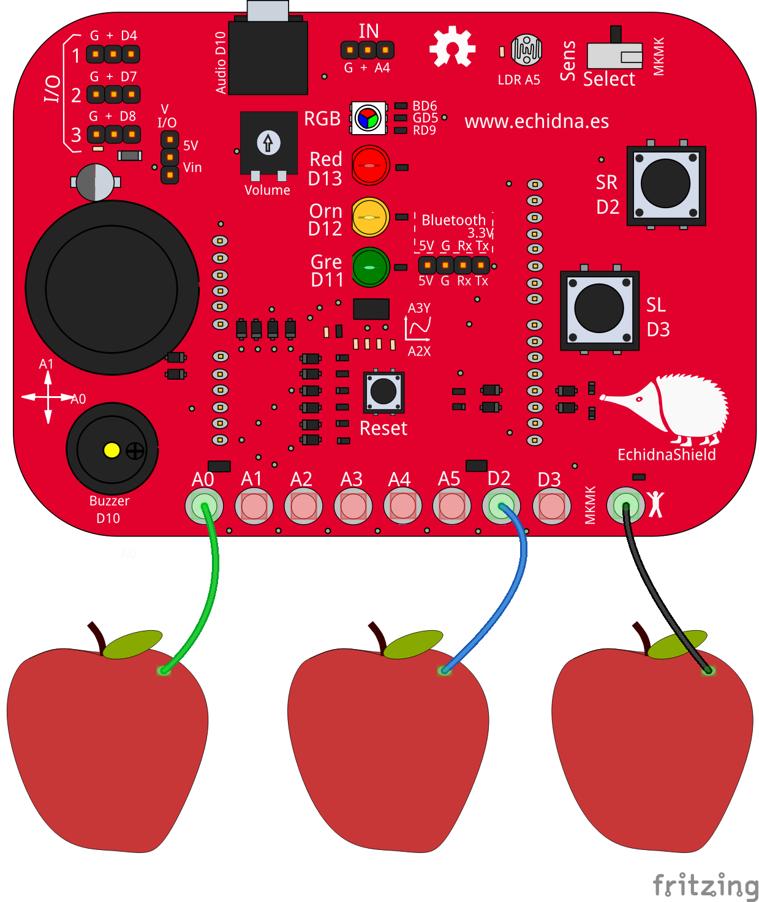

# MkMk
Programas usando las conexiones y el modo MkMk

 

## [1. Lectura MkMk](https://github.com/EchidnaShield/Recursos/blob/master/Didactica/Actividades_IDE_Arduino/MkMk/lecturaMkMk/lecturaMkMk.ino)
Lectura de las entradas MkMk para ver que valores dan con circuito abierto y circuito cerrado y poder programarlas a posteriori

