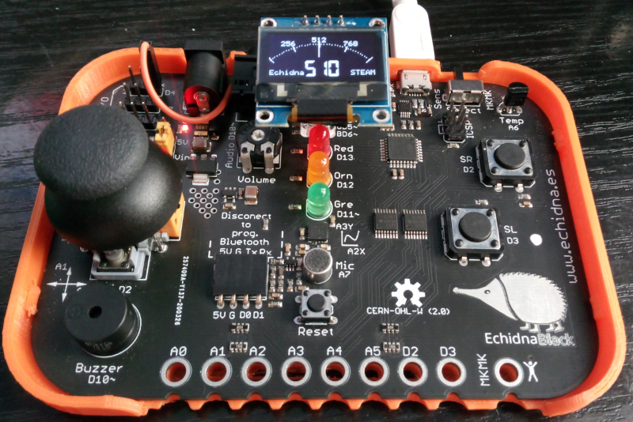

# OLED
Programas para pantalla  OLED SSD1306  usando las conexiones A4 Y D4 conectadas a SDA y SCL de la pantalla

 

## [1. Circulo_OLED](https://github.com/EchidnaShield/Recursos/blob/master/Didactica/Actividades_IDE_Arduino/OLED/Circulo_OLED/Circulo_OLED.ino)
   Programa simple para iniciarse en lectura analógica y representarla en la pantalla.

## [2. Medidor Analógico](https://github.com/EchidnaShield/Recursos/tree/master/Didactica/Actividades_IDE_Arduino/OLED/Medidor_OLED)
   Programa para representar valores en un medidor "analógico" cubriendo 180º, ete medidor puede ser escalado.

## [3. Medidor Analógico II](https://github.com/EchidnaShield/Recursos/tree/master/Didactica/Actividades_IDE_Arduino/OLED/Medidor_II_OLED)
   Programa para representar valores en un medidor "analógico Clásico".

## [4. Echidna test OLED ](https://github.com/EchidnaShield/Recursos/tree/master/Didactica/Actividades_IDE_Arduino/OLED/EchidnaOledTest)
   Representación gráfica de los sensores que tiene EchidnaBlack, adaptable a EchidnaShield, tiene un menú para pasar de un a otro sensor.

