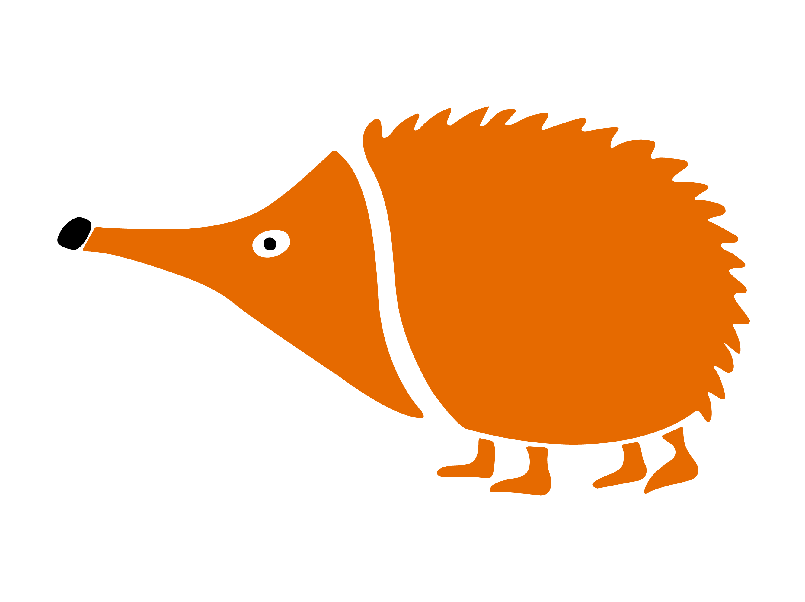

# Logos de Echidna

- [Logo en png](https://github.com/EchidnaShield/Recursos/blob/master/Logos/Logo_Echidna.png)
- [Logo en svg](https://github.com/EchidnaShield/Recursos/blob/master/Logos/Logo_Echidna.svg)
- [Logo son subtitulo EchidnaEducación en png](https://github.com/EchidnaShield/Recursos/blob/master/Logos/Logo_Echidna-web.png)

El logo de Echidna es una creación de Jorge Lobo para Echidna Educación, y se distribuyen bajo licencia [Creative Commons Attribution-ShareAlike 4.0 International License](http://creativecommons.org/licenses/by-sa/4.0/)
