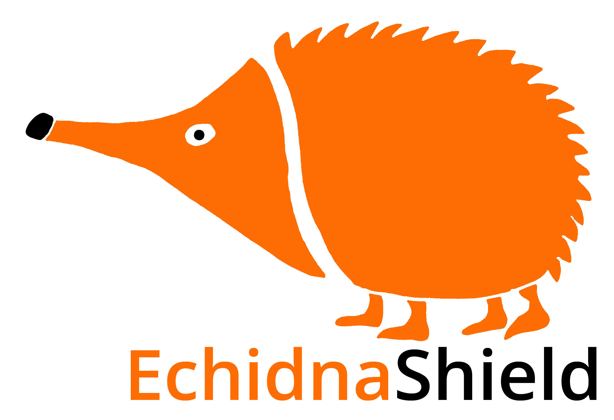

# Recursos

Repositorio con recursos de Echidna Educacion

[www.echidna.es](http://echidna.es/)

## Didáctica
### Primaria Actividades 
[Actividades para trabajar con Echidna en Educación Primaria](https://github.com/EchidnaShield/Recursos/tree/master/Didactica/Actividades_Primaria)
### Secundaria Actividades 
[Actividades para trabajar con Echidna en Educación Secundaria](https://github.com/EchidnaShield/Recursos/tree/master/Didactica/Actividades)
### Actividades IDE Arduino
[Actividades para trabajar con el IDE de Arduino](https://github.com/EchidnaShield/Recursos/tree/master/Didactica/Actividades_IDE_Arduino)
### Talleres
[Material de los talleres impartidos](https://github.com/EchidnaShield/Recursos/tree/master/Didactica/Talleres)

## Electronica
[Esquemas electrónicos](https://github.com/EchidnaShield/Recursos/tree/master/electronica)

## Diseños3D
[Diseños para impresión 3D](https://github.com/EchidnaShield/Recursos/tree/master/Dise%C3%B1os3D)

## Aplicaciones Varias
[Aplicaciones varias, test...](https://github.com/EchidnaShield/Recursos/tree/master/Aplicaciones%20Varias)

## Licencia
Todos los contenidos pertenecen a Echidna Educación, han sido desarrollados por Jorge Lobo, Xabier Rosas y Jose Pujol, y se distribuyen bajo licencia [Creative Commons Attribution-ShareAlike 4.0 International License](http://creativecommons.org/licenses/by-sa/4.0/)
