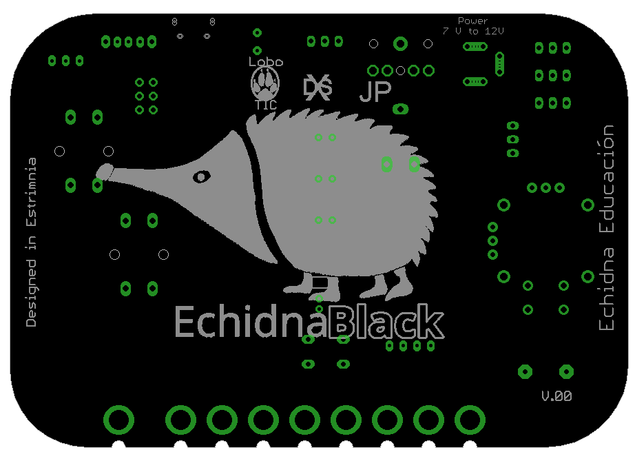

# EchidnaBlack

## Dispositivos/conexiones

## Vista

## Superior

## inferior

## Esquema
[Esquema PDF](https://github.com/EchidnaShield/Recursos/blob/master/electronica/Black/EchidnaBlack_0_ESQ.pdf)

## Características
[Docu PDF](Documentacion Echidna Black 0_0.pdf)

## Licencia
Todos los contenidos pertenecen a Echidna Educación, han sido desarrollados por Jorge Lobo, Xabier Rosas y Jose Pujol, y se distribuyen bajo licencia [Creative Commons Attribution-ShareAlike 4.0 International License](http://creativecommons.org/licenses/by-sa/4.0/)
