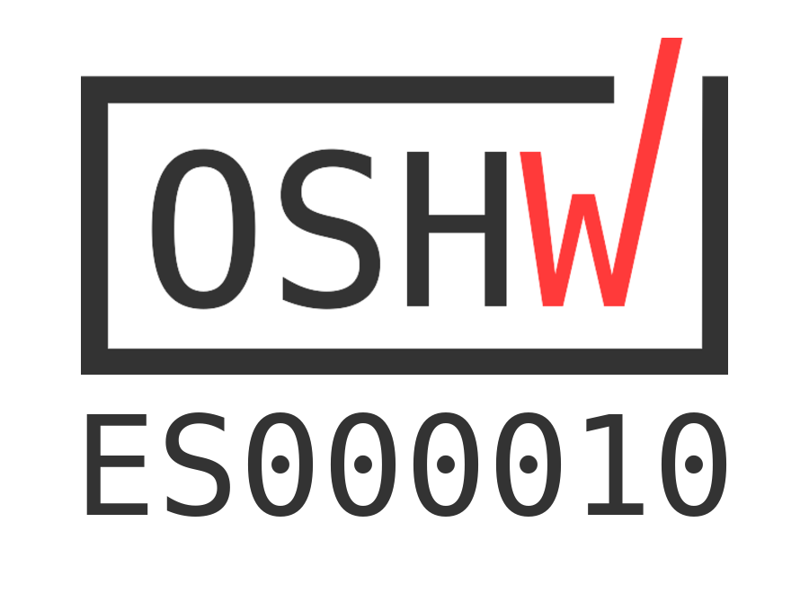

# EchidnaBlack

## Certificado CE:

Certificado CE Nº: ISETC.000520201231

Referente técnico: EBO2012089-E174

Según las directivas de compatibilidad electromagnética 2014/30/EU:

    EN 55032:2015+A11:2020; Compatibilidad electromagnética de equipos multimedia – Requisitos de emisión
    EN 55035:2017; Compatibilidad electromagnética de equipos multimedia – requisitos de inmunidad

## RoHS:

Los componentes y soldaduras cumplen con la normativa RoHS
Open Source Hardware Certification:

##OSHWA EchidnaBlack está certificada como Open Source Hardware con registro UID ES000010 por la Open Source Hardware Association (OSHWA)

## License

Every content in this repo, otherwise specified under subdirectories, is
licensed under [Creative Commons BY-SA][LICENSEcc] for documentation and [CERN Open Hardware Licence -W- V2][OHL-W-V2].

[LICENSEcc]: https://creativecommons.org/licenses/by-sa/3.0/es
[OHL-W-V2]: https://ohwr.org/project/cernohl/wikis/Documents/CERN-OHL-version-2
