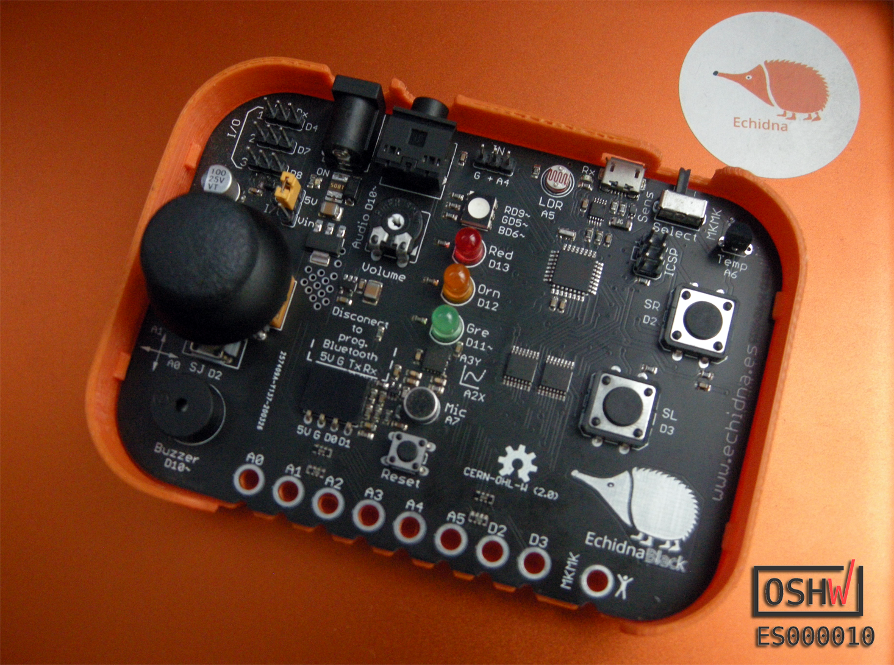

# EchidnaBlack

## License

Every content in this repo, otherwise specified under subdirectories, is
licensed under [Creative Commons BY-SA][LICENSEcc] for documentation and [CERN Open Hardware Licence -W- V2][OHL-W-V2].

[LICENSEcc]: https://creativecommons.org/licenses/by-sa/3.0/es
[OHL-W-V2]: https://ohwr.org/project/cernohl/wikis/Documents/CERN-OHL-version-2
